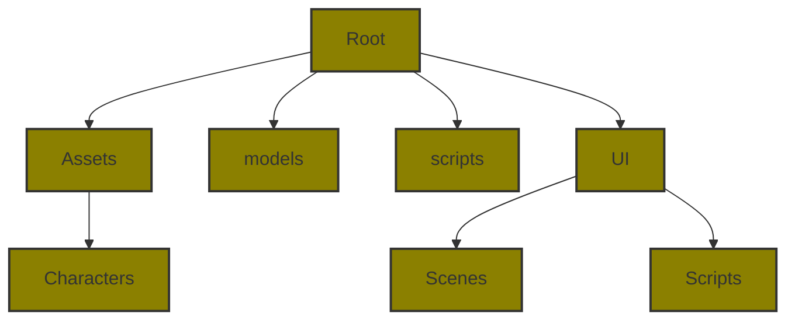

# Digital Guess Who Game repository

Welcome to the digitized version of the classic Guess Who game! This multiplayer game recreates the deduction-based fun of the original, with streamlined mechanics for a modern, interactive experience.

## Features
Multiplayer functionality with hosting and joining options.
Automated turn tracking for seamless gameplay.
Question-building system using dropdown menus (enums).
Right-click to make a final guess on the opponent's character.
Intuitive controls for eliminating faces and managing gameplay.

## How to Play

### Setup

Enter your name on the main menu.
Select Host to create a game server or Join to connect to an existing one.
Click the Start Game button once all players are ready.

# Gameplay

Turn Actions:
Move your head and lower faces on your board to eliminate possibilities.
Press the Question button to open a menu for building your question using enums.
Submit your question to receive a Yes or No response.

Making a Guess:
Right-click to guess the opponent's character.
Guess carefully—an incorrect guess may cost you the game!
Objective

Be the first to correctly identify your opponent's character by asking strategic questions and using logical deduction.

## Project Structure

Scripts folder – All game logic, including turn management, question building, and multiplayer functionality.
Scenes folder – Contains the game board, main menu, and other UI elements.
Assets folder– Sprites, textures, and other visual assets used in the game.
UI folder - UI Scripts and Scenes
README.md – This file, for understanding the repository structure and rules.

## Requirements
Godot Engine 4.2
A stable network connection for multiplayer functionality.

## License
????
